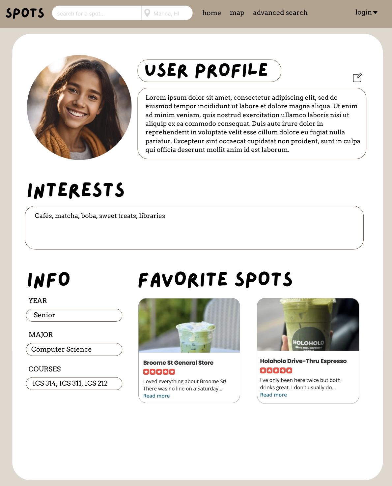
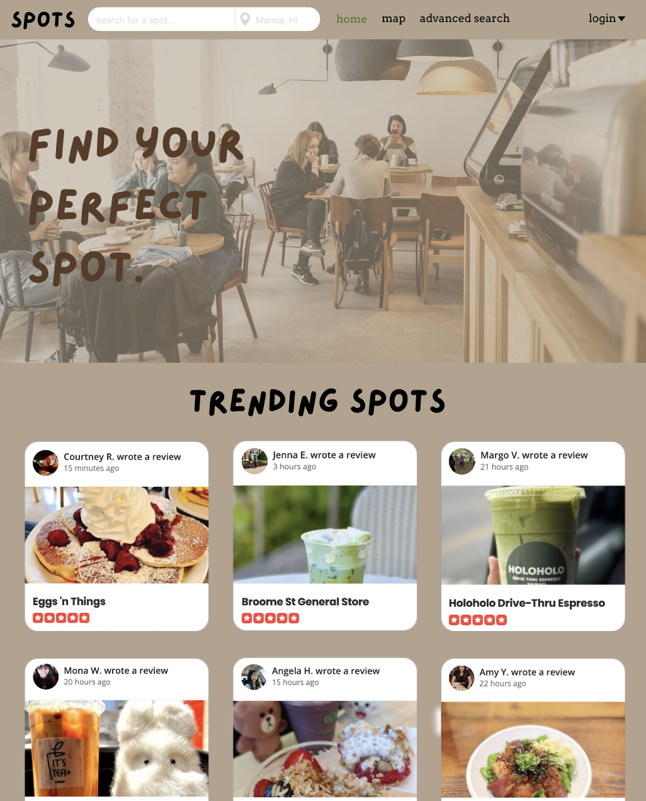
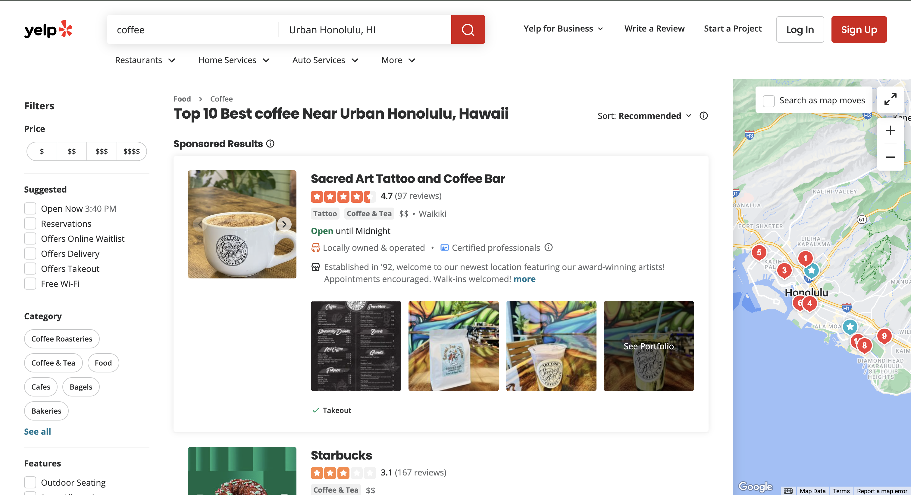
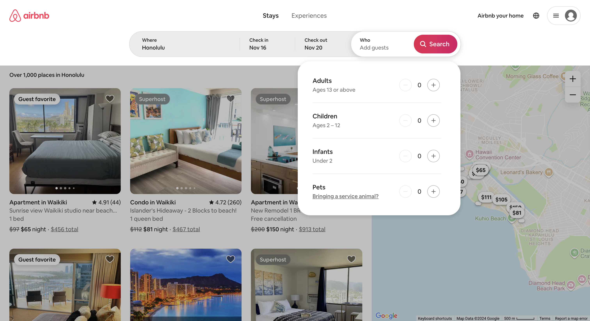

# Spots

## Table of contents

* [Overview](#overview)
* [Approach](#approach)
* [Mockup Page Ideas](#mockup-page-ideas)
* [Team Contract](#team-contract)

## Overview

As college students, we share the struggle of finding a nice spot to study, hangout, relax, or meet new people. In addition, some unicorn places heard about from a friend of a friend are hard to find and might not even be worth the effort and time to get there. We will create a guide to spots on and around campus including a map, descriptions, photos, amenities, a rating system based on quietness, crowd levels, social opportunities, etc. Students can easily find, add, and rate spots, fostering a community of interaction and academic success.

## Approach

To use the application, students must create an account and set up their profiles. With these profiles, students can list their major, courses, year, and interests so that it’s easier to find those with similarities. There could also be a friend/following system that will help students to build trust and friendship with one another. Users must use their hawaii.edu email addresses to confirm that they are students at UH for safety concerns. In order to find the optimal study spots, there could be a map of cafe locations, as well as a rating system for each spot that gives the details on volume levels, seating, ambiance, hours, and general ideas of how “study friendly” the areas are.

## Mockup Page Ideas:

* **Profile Page**: Users can input their preferences for study spaces and it can showcase personal history or study stats.

* **Home/Landing Page**: Overview of trending study spots or recently visited locations based on proximity to the user.

* Map Page: Interactive map to show real-time availability and how far away study locations are from the user.
* Spot Details: Individual pages for each spot with detailed information (ex. description, photos, reviews, capacity, amenities, noise levels, parking, ect.)
* Favorites: Users can save their favorite study spots and it can suggest new study spots based on their favorites.
* New Spot Page: Allow users to add new spots that they find and input location details.

Utilize map pages to show spots in close proximity to users.

Users can use filters to apply to their searches to filter their search results.

## Team Contract 

[Click here!](https://docs.google.com/document/d/1qr-8XbC5mJwhmVOqp7jBJMfaa8kXPuwWPiLqjrGsctY/edit?usp=sharing)

## Team

Spots is designed, implemented, and maintained by [Rylee Au](https://ryleeau.github.io), [Zelda Cole](https://zeldaco.github.io), [Arissa Dang](https://arissadang.github.io/), and [Diana Reis](https://dianathreis.github.io/).
