# Manoa Spots

*[Application Repository](https://github.com/manoa-spots/manoa-spots-app)
*[Github.io Repository](https://github.com/manoa-spots/manoa-spots.github.io)

## Table of contents

* [Overview](#overview)
* [Approach](#approach)
* [User Guide](#user-guide)
* [Milestone 1](#milestone-1)
* [Milestone 2](#milestone-2)
* [Milestone 3](#milestone-3)
* [Community Feedback](#community-feedback)
* [Developer Guide](#developer-guide)

## Overview

As college students, we share the struggle of finding a nice spot to study, hangout, relax, or meet new people. In addition, some unicorn places heard about from a friend of a friend are hard to find and might not even be worth the effort and time to get there. We will create a guide to spots on and around campus including a map, descriptions, photos, amenities, a rating system based on quietness, crowd levels, social opportunities, etc. Students can easily find, add, and rate spots, fostering a community of interaction and academic success.

## Approach

To use the application, students must create an account and set up their profiles. With these profiles, students can list their major, courses, year, and interests so that it’s easier to find those with similarities. There could also be a friend/following system that will help students to build trust and friendship with one another. Users must use their hawaii.edu email addresses to confirm that they are students at UH for safety concerns. In order to find the optimal study spots, there could be a map of cafe locations, as well as a rating system for each spot that gives the details on volume levels, seating, ambiance, hours, and general ideas of how “study friendly” the areas are.

## User Guide
1. Begin at the landing page, and either sign up or sign in to access Spots.

<p float="left">
  
  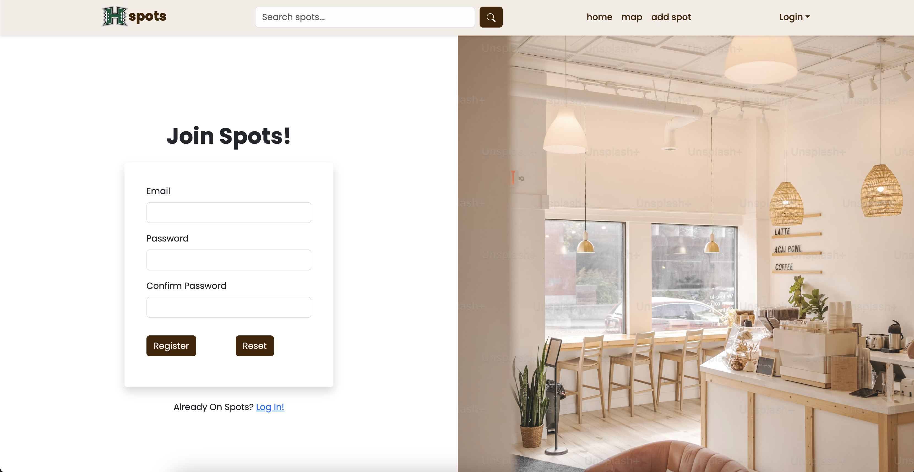 
  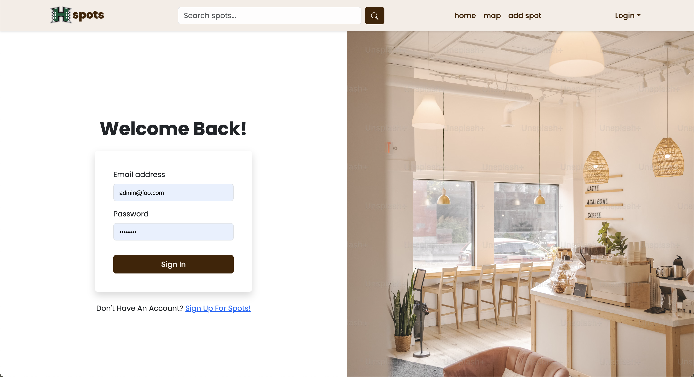
</p>

2. Once you're logged in, you can view recommended spots based off your interests and preferences.

  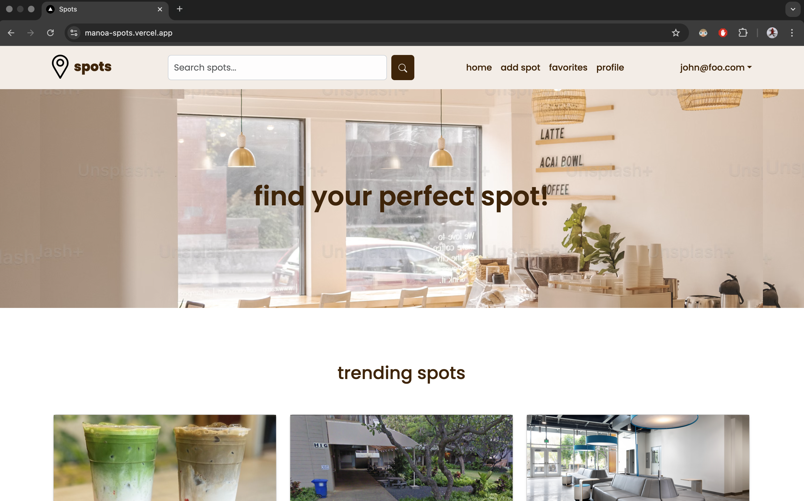
  
3. You can also view and edit your profile to your preferences.

  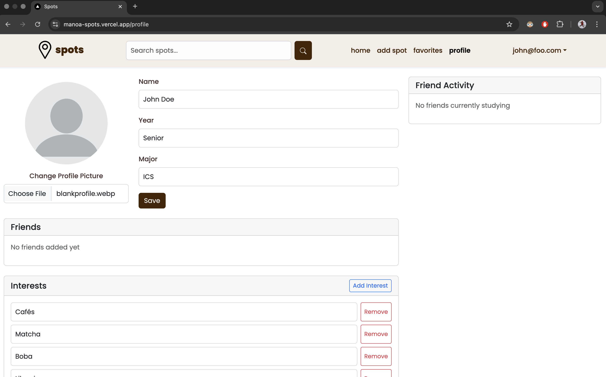
  
  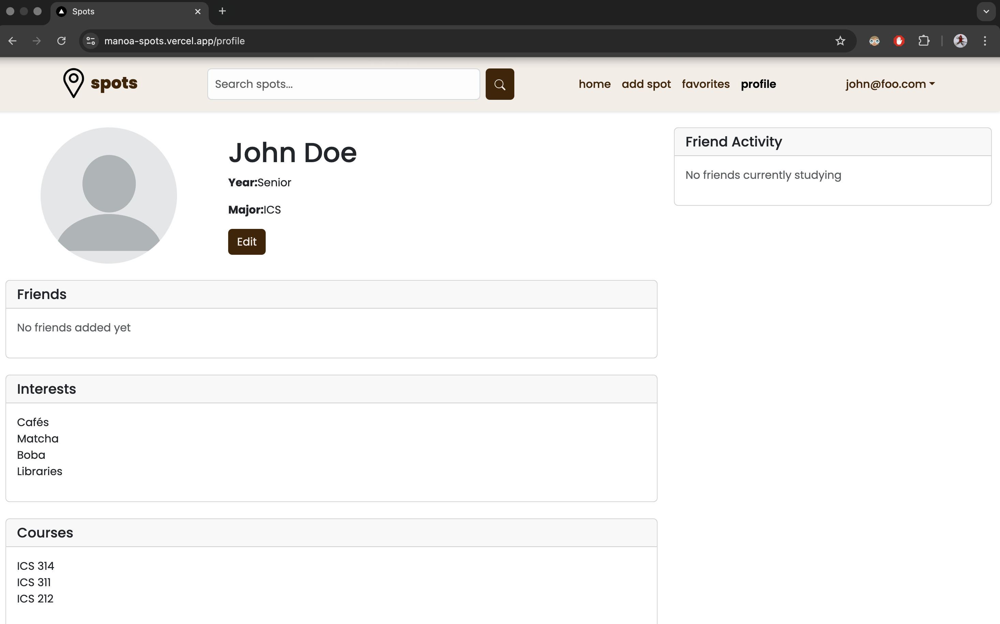
    
5. If you have a Spot you'd like to share with the community, navigate to "add spot" and add your spot. 

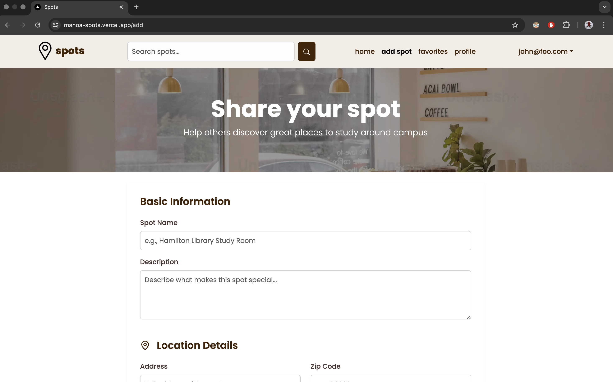

5. To search for spots, search for one in the search bar. From here you can apply filters to find the perfect one.

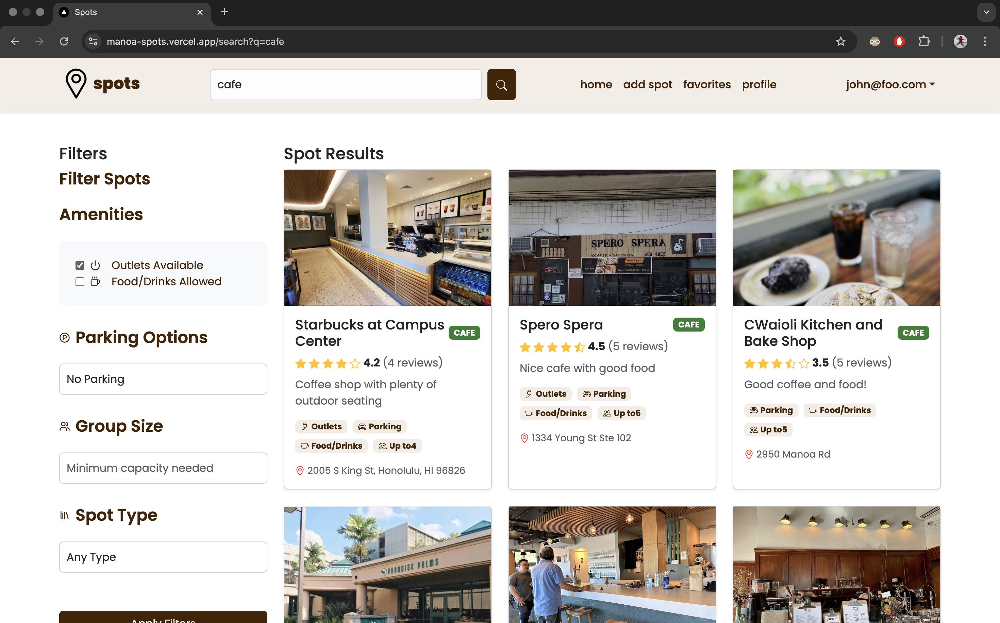
  
7. Clicking on the Spot will give you more details.Clicking on the heart on any Spot card will add it to your favorites.

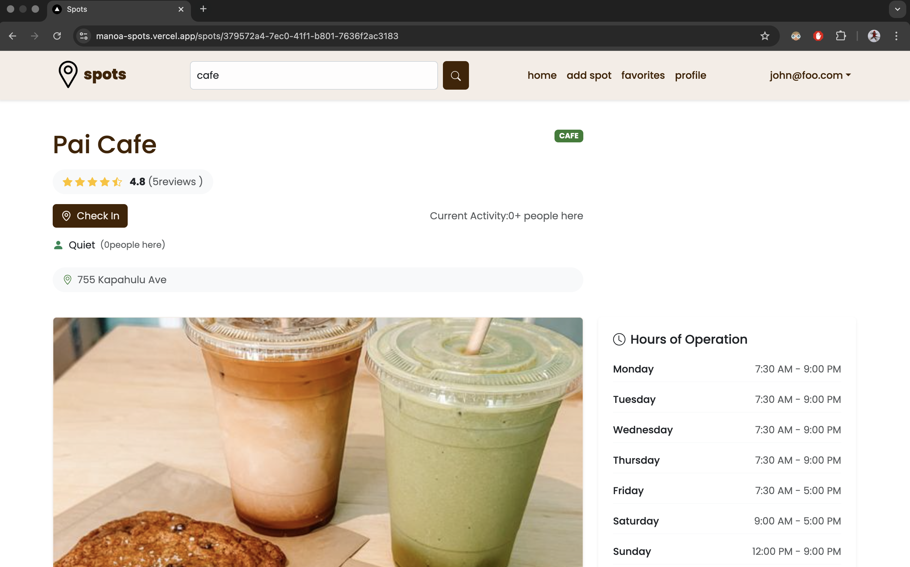

9. You can "Check In" to a Spot to let others know how many others are there. The system will check you out after an hour, but you can also check out manually.

<p float="left">
  
  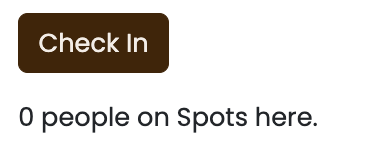
  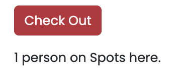 
</p>

6. Click on "favorites" to view your favorites.


8. Now you have hopefully found your perfect Spot!

## [Milestone 1](https://github.com/orgs/manoa-spots/projects/1)
For our first Milestone, the Landing Page and Sign In Pages were implemented. General mockups were made of the Favorites and Profile Page here.
## [Milestone 2](https://github.com/orgs/manoa-spots/projects/2)
The functionality of Spots significantly improved during this milestone. More data was added to the Spot Cards, and the Advanced Search was set up with filters. The ability to edit your profile was also implemented. 
## [Milestone 3](https://github.com/orgs/manoa-spots/projects/5)
The most progress was made during this Milestone, with more real data as well as individual Spot Cards. The Favorites functionality was set up as well as the Check In function.

## Community Feedback

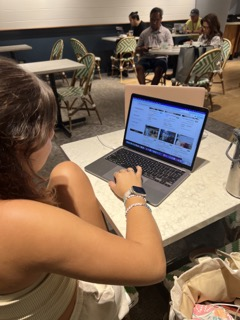

Reviewer 1: She stated that she liked the aesthetic and color scheme of the website. She suggested placing the parking options to be listed under amenities instead of as its own section.


Reviewer 2: "The website looks legit but it would be cool if there was a way to see if the search filter actually applied like a message." 


Reviewer 3: "I liked how you could see more information for a spot when you click it."


Reviewer 4: "I would use this."


Reviewer 5: "It looks really good!"

## Developer Guide
1. Copy the repo to Github Desktop.
2. Open in VSCode, and run
```
npm install.
```
3. Enter 
```
npm run dev
```
to run the website locally.
4. Once any changes are made, commit to Github and see the changes on Vercel.

## Team

Spots is designed, implemented, and maintained by [Rylee Au](https://ryleeau.github.io), [Zelda Cole](https://zeldaco.github.io), [Arissa Dang](https://arissadang.github.io/), and [Diana Reis](https://dianathreis.github.io/).
