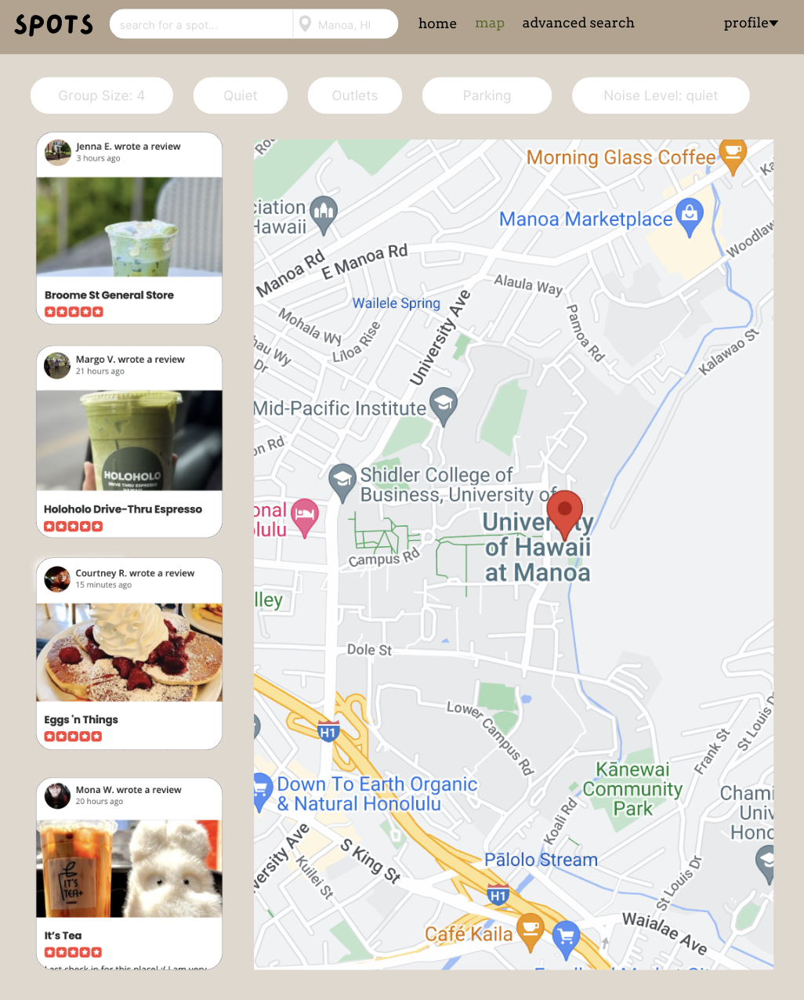
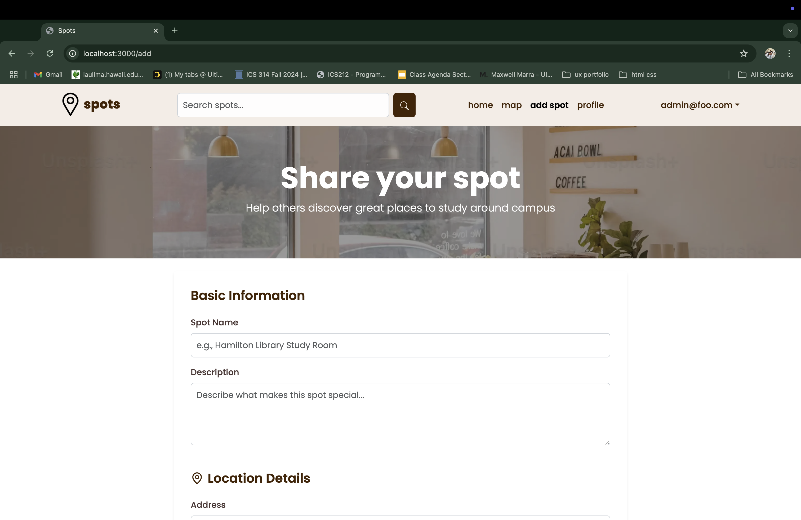
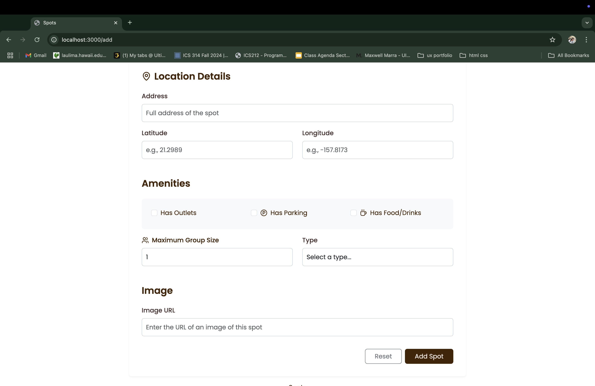
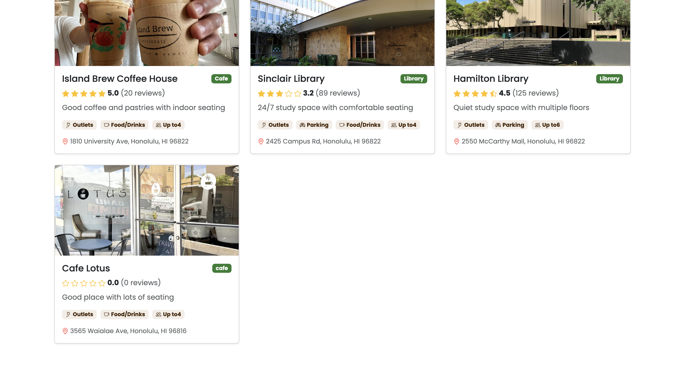
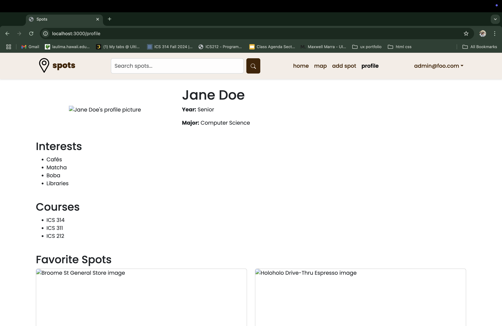
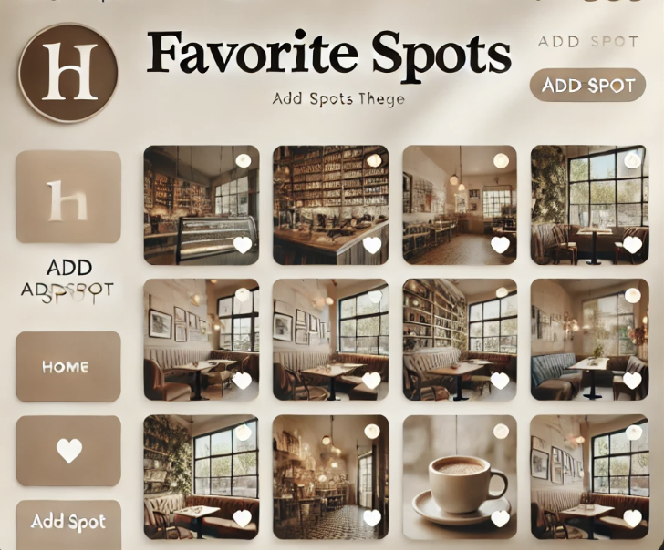
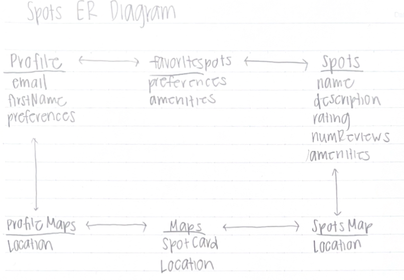

## Table of contents

* [Overview](#overview)
* [Approach](#approach)
* [Mockup Page Ideas](#mockup-page-ideas)
* [Milestone 1](#milestone-1)
* [Milestone 2](#milestone-2)
* [Milestone 3](#milestone-3)
* [User Guide](#user-guide)
* [Developer Guide](#developer-guide)

## Overview

As college students, we share the struggle of finding a nice spot to study, hangout, relax, or meet new people. In addition, some unicorn places heard about from a friend of a friend are hard to find and might not even be worth the effort and time to get there. We will create a guide to spots on and around campus including a map, descriptions, photos, amenities, a rating system based on quietness, crowd levels, social opportunities, etc. Students can easily find, add, and rate spots, fostering a community of interaction and academic success.

## Approach

To use the application, students must create an account and set up their profiles. With these profiles, students can list their major, courses, year, and interests so that it’s easier to find those with similarities. There could also be a friend/following system that will help students to build trust and friendship with one another. Users must use their hawaii.edu email addresses to confirm that they are students at UH for safety concerns. In order to find the optimal study spots, there could be a map of cafe locations, as well as a rating system for each spot that gives the details on volume levels, seating, ambiance, hours, and general ideas of how “study friendly” the areas are.

## Mockup Page Ideas:

* **Profile Page**: Users can input their preferences for study spaces and it can showcase personal history or study stats.

* **Home/Landing Page**: Overview of trending study spots or recently visited locations based on proximity to the user.

* Map Page: Interactive map to show real-time availability and how far away study locations are from the user.

* Search Page: Returns spots that match an inputted text to search inquiry, as well as advanced search options through filters based on spot amenities.
  
* Spot Details: Individual pages for each spot with detailed information (ex. description, photos, reviews, capacity, amenities, noise levels, parking, ect.)
* Favorites: Users can save their favorite study spots and it can suggest new study spots based on their favorites.
* New Spot Page: Allow users/vendors to add new spots that they find and input location details.

## [Milestone 1](https://github.com/orgs/manoa-spots/projects/1)
## [Milestone 2](https://github.com/orgs/manoa-spots/projects/2)

### Landing Page


### Add a Spot Page

users can add their favorite spots onto the app for others to discover with the "add spot" page.





this updates the spot database and the newly added spots can now be found through searches and on featured spot pages.



### Sign-in Page


### Sign-up Page


### Profile Page



### Favorite Spots Page



## [Milestone 3](https://github.com/orgs/manoa-spots/projects/5)

## User Guide
1. Begin at the landing page, and either sign up or sign in to access Spots. 
<p float="left">
  
   
  
</p>
2. Once you're logged in, you can view recommended spots based off your interests and preferences.
  
3. If you have a Spot you'd like to share with the community, navigate to "add spot" and add your spot. 

4. Click on "favorites" to view your favorites.

5. Click on "advanced search" to filter search for specific spots.

## Developer Guide
1. Copy the repo to Github Desktop.
2. Open in VSCode, and run
```
npm install.
```
3. Enter 
```
npm run dev
```
to run the website locally.
4. Once any changes are made, commit to Github and see the changes on Vercel.

## ER Diagram


## Team

Spots is designed, implemented, and maintained by [Rylee Au](https://ryleeau.github.io), [Zelda Cole](https://zeldaco.github.io), [Arissa Dang](https://arissadang.github.io/), and [Diana Reis](https://dianathreis.github.io/).
